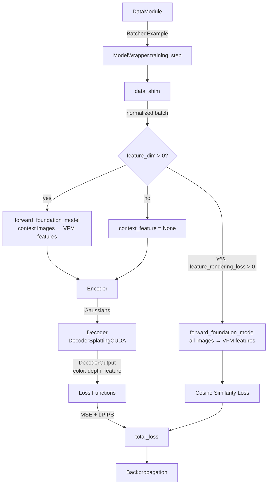
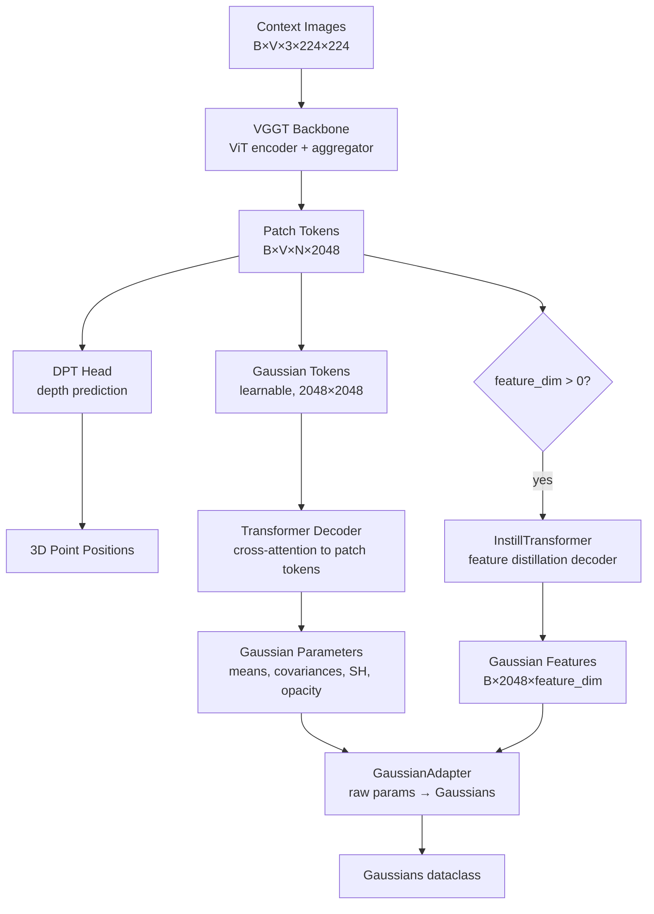

# Architecture Overview

## End-to-End Data Flow



## Core Data Types

### BatchedExample (`src/dataset/types.py`)

The primary data structure flowing through the pipeline:

```python
class BatchedViews(TypedDict, total=False):
    extrinsics: Float[Tensor, "batch view 4 4"]    # camera-to-world matrices
    intrinsics: Float[Tensor, "batch view 3 3"]    # normalized K matrices
    image: Float[Tensor, "batch view channel H W"] # RGB images [0,1]
    near: Float[Tensor, "batch view"]              # near plane
    far: Float[Tensor, "batch view"]               # far plane
    index: Int64[Tensor, "batch view"]             # frame indices
    overlap: Float[Tensor, "batch view"]           # view overlap ratio

class BatchedExample(TypedDict, total=False):
    target: BatchedViews    # views to reconstruct
    context: BatchedViews   # input views for the encoder
    scene: list[str]        # scene identifiers
```

### Gaussians (`src/model/types.py`)

The 3D representation predicted by the encoder:

```python
@dataclass
class Gaussians:
    means: Float[Tensor, "batch gaussian dim"]          # 3D positions
    covariances: Float[Tensor, "batch gaussian dim dim"] # 3x3 covariance matrices
    harmonics: Float[Tensor, "batch gaussian 3 d_sh"]   # spherical harmonics (color)
    opacities: Float[Tensor, "batch gaussian"]          # per-Gaussian opacity
    feature: Float[Tensor, "batch gaussian feature_dim"] # distilled VFM features (or None)
```

With `num_gaussians=2048`, the encoder predicts exactly 2048 Gaussians per batch element.

### DecoderOutput (`src/model/decoder/decoder.py`)

```python
@dataclass
class DecoderOutput:
    color: Float[Tensor, "batch view 3 H W"]           # rendered RGB
    depth: Float[Tensor, "batch view H W"]             # rendered depth
    feature: Float[Tensor, "batch view feat_dim H W"]  # rendered features (or None)
```

## Encoder Selection

The encoder is selected via `model.encoder.name` in the config:

| Config Name | Class | Use Case |
|-------------|-------|----------|
| `"noposplat"` | `EncoderNoPoSplat` | 2-view input, CroCo backbone |
| `"noposplat_multi"` | `EncoderNoPoSplatMulti` | Multi-view input, CroCo backbone |
| `"vggt"` | `EncoderVGGT` | Multi-view input, VGGT-1B backbone (default in C3G) |

The default C3G configuration uses `EncoderVGGT` with the VGGT-1B backbone (`backbone.name: vggt_multi`).

## Encoder Architecture (EncoderVGGT)



Key components:

- **VGGT Backbone**: Frozen or fine-tuned ViT encoder with multi-view aggregation
- **DPT Head**: Dense Prediction Transformer head for depth/point estimation
- **Gaussian Tokens**: Learnable tokens (2048 × 2048-dim) that attend to image features
- **Transformer/InstillTransformer**: Cross-attention decoder layers
- **GaussianAdapter/UnifiedGaussianAdapter**: Converts raw network outputs to proper Gaussian parameters (applies activations, constructs covariance matrices)

## Feature Distillation Path

When `train.feature_rendering_loss > 0`, the model learns to embed VFM features into the Gaussians:

1. The encoder's `InstillTransformer` predicts per-Gaussian features of dimension `gaussian_feature_dim`
2. The decoder renders these features into 2D feature maps via splatting
3. A cosine similarity loss aligns rendered features with VFM features extracted from target views
4. At test time, rendered features can be decoded into semantic labels using the VFM's text encoder (e.g., LSeg label decoding, CLIP text matching)

## Decoder Architecture

`DecoderSplattingCUDA` performs differentiable Gaussian rasterization:

1. Repeats Gaussians across all target views
2. Calls `render_cuda` (gsplat-based) with camera parameters
3. Supports `cam_rot_delta` / `cam_trans_delta` for differentiable pose optimization
4. `make_scale_invariant=True`: normalizes Gaussian means to unit scale before rendering
5. `low_pass_filter`: anti-aliasing parameter that decreases during training
6. `feature_detach`: optionally detaches Gaussian geometry gradients from feature rendering
