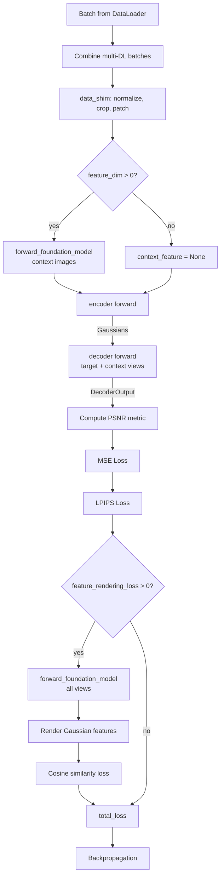

# Training and Losses

## Entry Point

Training starts in `src/main.py` via the Hydra-decorated `train()` function:

```python
@hydra.main(version_base=None, config_path="../config", config_name="main")
def train(cfg_dict: DictConfig):
    cfg = load_typed_root_config(cfg_dict)
    ...
```

The function:

1. Loads and types the config (`RootCfg`)
2. Sets up W&B logger and checkpointing callbacks
3. Loads foundation model (VFM) based on `cfg.train.reproj_model`
4. Sets `cfg.model.encoder.feature_dim` from VFM feature dimension
5. Builds encoder, loads pretrained weights
6. Constructs `ModelWrapper`, `DataModule`
7. Dispatches to `trainer.fit()` or `trainer.test()`

## Training Step Flow

`ModelWrapper.training_step()` in `src/model/model_wrapper.py`:



Key details:

- **Context view loss**: When `train.context_view_loss=True`, the decoder renders both target AND context views, and losses are computed on all of them. Context images are normalized from [-1,1] to [0,1] before loss computation.
- **Random context view selection**: When `train.random_select_context_view=True` (multiview training), randomly selects 2 to V context views per step (synchronized across GPUs via `dist.broadcast`).

## Loss Functions

### LossMse (`src/loss/loss_mse.py`)

Simple pixel-wise MSE loss:

```python
def forward(self, prediction, batch, gaussians, global_step, target_image=None):
    delta = prediction.color - target_image
    return self.cfg.weight * (delta**2).mean()
```

Config: `weight: 1.0`

### LossLpips (`src/loss/loss_lpips.py`)

Perceptual loss using VGG-based LPIPS:

```python
def forward(self, prediction, batch, gaussians, global_step, target_image=None):
    if global_step < self.cfg.apply_after_step:
        return torch.tensor(0)
    loss = self.lpips.forward(prediction.color, image, normalize=True)
    return self.cfg.weight * loss.mean()
```

Config: `weight: 0.05`, `apply_after_step: 20000`

The LPIPS network is converted to buffers (non-trainable) via `convert_to_buffer`.

### Feature Rendering Loss (inline in training_step)

Cosine similarity between rendered Gaussian features and VFM features:

```python
# Extract VFM features for all views
feature = forward_foundation_model(all_images, interpolate=False)

# Resize rendered features to match VFM resolution
gaussian_feature = F.interpolate(output.feature, size=(FH, FW))

# L2-normalize both
gaussian_feature = F.normalize(gaussian_feature, p=2, dim=2)
feature = F.normalize(feature, p=2, dim=2)

# Cosine similarity loss
feature_rendering_loss = (1 - F.cosine_similarity(gaussian_feature, feature.detach(), dim=2)).mean()
total_loss += train_cfg.feature_rendering_loss * feature_rendering_loss  # weight: 0.01
```

The VFM features are detached — gradients only flow through the Gaussian feature branch.

### Additional Loss Files

| File | Purpose |
|------|---------|
| `loss_point.py` | Point cloud regularization loss |
| `loss_ss.py` | Self-supervised loss |
| `loss_ssim.py` | SSIM-based structural loss (used in pose optimization) |

## Optimizer Configuration

```python
@dataclass
class OptimizerCfg:
    lr: float                    # 1e-4
    warm_up_steps: int           # 1000
    backbone_lr_multiplier: float # 0.01
```

The optimizer uses different learning rates for backbone vs. other parameters:

- Backbone parameters: `lr * backbone_lr_multiplier` (typically 100× smaller)
- Other parameters: `lr`

Linear warm-up over `warm_up_steps` steps.

## Trainer Configuration

```python
@dataclass
class TrainerCfg:
    max_steps: int              # 450001
    val_check_interval: int     # 1000
    gradient_clip_val: float    # 0.5
    num_nodes: int              # 1
    accumulate_grad_batches: int # 1
```

Multi-GPU training uses DDP with:

- `find_unused_parameters=False`
- `broadcast_buffers=False`
- `gradient_as_bucket_view=True`

## Checkpoint Loading

`src/main.py` handles three checkpoint formats:

### Format 1: `'model'` key

```python
ckpt_weights = ckpt_weights['model']
ckpt_weights = checkpoint_filter_fn(ckpt_weights, encoder)
encoder.load_state_dict(ckpt_weights, strict=False)
```

Used for VGGT-style checkpoints. `checkpoint_filter_fn` filters/remaps keys.

### Format 2: `'state_dict'` key

```python
ckpt_weights = ckpt_weights['state_dict']
ckpt_weights = {k[8:]: v for k, v in ckpt_weights.items() if k.startswith('encoder.')}
encoder.load_state_dict(ckpt_weights, strict=False)
```

Used for Lightning checkpoints. Strips the `encoder.` prefix.

### Format 3: Raw dict with `aggregator`/`point_head` keys

```python
new_ckpt = {}
for key, value in ckpt_weights.items():
    if 'aggregator' in key:
        new_ckpt[f'backbone.{key}'] = value
    if 'point_head' in key:
        new_ckpt[key.replace('point_head', 'dpt_head')] = value
encoder.load_state_dict(new_ckpt, strict=False)
```

Used for older VGGT checkpoints with different naming conventions.

## Training Tips

- **Gaussian head first**: Always train the Gaussian decoder before the feature decoder
- **Low-pass filter**: Starts at 10.0 for multiview, decreases to 0.3 during training (anti-aliasing)
- **Batch size**: 4 for Gaussian training, 2 for feature training (higher memory from VFM)
- **Feature decoder is fast**: Only 5001 steps needed (vs. 450001 for Gaussian decoder)
- **NUM_SEMANTIC_CHANNELS**: Must match VFM feature dimension in CUDA rasterizer config (256 for SAM — see [12-c3g-sam.md](12-c3g-sam.md))

## C3G-SAM training

C3G-SAM uses two formulations selectable via Hydra `+training=` presets or Modal `--experiment`:

| Form | Hydra preset (ScanNet) | Wrapper | Modal command |
|------|------------------------|---------|---------------|
| 1 — Distillation | `feature_head_sam_precomputed` | `DistillationModelWrapper` | `modal run src/modal/train.py --wait` |
| 2 — Prompted | `feature_head_sam_prompted_scannet` | `ModelWrapper` | `modal run … --experiment prompted --wait` |

- **Form 1** requires precomputed `{frame_id}_sam.pt` files (`scripts/precompute_sam_features.py` or Modal precompute runner).
- **Form 2** loads SAM at train time; checkpoints ranked by **`val/loss`**, not IoU.
- Losses: `loss_segmentation.py`, `loss_segmentation_prompted.py`; feature magnitude + cosine in `distillation_wrapper.py`.

Guides: [12-c3g-sam.md](12-c3g-sam.md) · [distillation_training.md](distillation_training.md) · [prompted_training.md](prompted_training.md) · [arch-details.md](arch-details.md)
