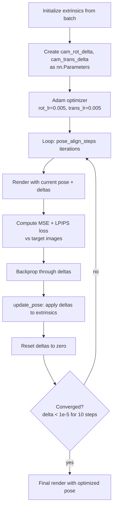

# Evaluation and Metrics

## Test Mode Entry

When `cfg.mode == "test"`, the main function calls:

```python
trainer.test(model_wrapper, datamodule=data_module, ckpt_path=checkpoint_path)
```

The Trainer sets `inference_mode=False` when `test.align_pose=True` (gradients needed for pose optimization).

## TestCfg Fields

```python
@dataclass
class TestCfg:
    output_path: Path              # outputs/test
    align_pose: bool               # True — enable pose optimization
    pose_align_steps: int          # 100 (or 1000 for ScanNet)
    rot_opt_lr: float              # 0.005
    trans_opt_lr: float            # 0.005
    compute_scores: bool           # True
    save_image: bool               # True
    save_video: bool               # False
    save_compare: bool             # False — save comparison grids
    visualize_gaussian_token: int  # -1 (disabled)
    forward_vfm: bool             # False — use VFM directly instead of rendered features
    labels: list[str]             # semantic labels for scene understanding
    color_hex_list: list[str]     # colors for segmentation visualization
```

## Novel View Synthesis Metrics

### PSNR (`src/evaluation/metrics.py::compute_psnr`)

Peak Signal-to-Noise Ratio. Computed per-image:

```python
mse = ((ground_truth - predicted) ** 2).mean(dim=[c,h,w])
psnr = -10 * mse.log10()
```

Both inputs are clipped to [0, 1].

### SSIM (`src/evaluation/metrics.py::compute_ssim`)

Structural Similarity Index. Uses `skimage.metrics.structural_similarity` with:

- `win_size=11`
- `gaussian_weights=True`
- `channel_axis=0`
- `data_range=1.0`

### LPIPS (`src/evaluation/metrics.py::compute_lpips`)

Learned Perceptual Image Patch Similarity using VGG network:

```python
lpips_model = LPIPS(net="vgg")
value = lpips_model.forward(ground_truth, predicted, normalize=True)
```

## Test Step Flow (NVS)

`ModelWrapper.test_step()`:

1. Apply `data_shim` to batch
2. Resize context images to 224×224 if needed
3. Extract VFM features if `encoder.cfg.feature_dim > 0`
4. Run encoder → Gaussians
5. If `align_pose=True`: run `test_step_align` (pose optimization)
6. Else: run decoder directly with ground-truth poses
7. Compute PSNR/SSIM/LPIPS
8. Save images, videos, comparison grids

## Pose Alignment (`test_step_align`)

Iterative test-time pose optimization that refines target camera poses:



Early stopping: If loss change < 0.00001 for 10 consecutive steps (after step 100), optimization terminates.

## PoseEvaluator (`src/evaluation/pose_evaluator.py`)

Standalone Lightning module for pose estimation evaluation:

1. Runs encoder to get Gaussians
2. Initializes pose via PnP-RANSAC (`get_pnp_pose`)
3. Optimizes pose with rotation/translation deltas (200 steps)
4. Adds SSIM structure loss alongside MSE + LPIPS
5. Computes rotation error, translation error, and combined pose error
6. Reports Pose AUC at thresholds [5°, 10°, 20°]

Metrics:

- `error_R`: Rotation angle error (degrees)
- `error_t`: Translation direction error (degrees)
- `error_pose`: max(error_R, error_t)

## Scene Understanding Evaluation (ScanNet/Replica)

When the model has feature distillation enabled (`encoder.cfg.feature_dim > 0`):

1. Render Gaussian features for target views
2. Extract VFM features from target images (ground truth)
3. Decode features into semantic predictions:
   - **LSeg**: `lseg_feature_extractor.decode_feature(features, labelset)`
   - **CLIP/MaskCLIP**: `clip_decode_feature(features, labelset)` — cosine similarity with text embeddings
4. `argmax` over classes → predicted segmentation
5. Compute metrics using `torchmetrics`:

```python
self.miou = JaccardIndex(task="multiclass", num_classes=len(labels)+1, ignore_index=0)
self.acc = Accuracy(task="multiclass", num_classes=len(labels)+1, ignore_index=0)
```

Class 0 is "unknown/background" and is ignored in metrics.

### Per-image vs. Epoch Metrics

- Per-image IoU and accuracy are stored in `self.per_image_ious` and `self.per_image_accs`
- `on_test_epoch_end()` computes and logs mean IoU and mean accuracy across all images

## EvaluationIndexGenerator (`src/evaluation/evaluation_index_generator.py`)

Generates evaluation indices for reproducible benchmarking:

```python
@dataclass
class EvaluationIndexGeneratorCfg:
    num_target_views: int    # number of target views per example
    min_distance: int        # minimum frame distance
    max_distance: int        # maximum frame distance
    min_overlap: float       # minimum view overlap
    max_overlap: float       # maximum view overlap
    output_path: Path
    save_previews: bool
    seed: int
```

Algorithm:

1. For each scene, pick a random context frame
2. Step away in both directions until overlap is within [min, max]
3. Pick random target views between context pair
4. Save as JSON with `IndexEntry(context, target, overlap)`

## Output Directory Layout

```
outputs/test/<wandb_name>/
├── <scene_name>/
│   ├── color/
│   │   ├── 000000.png
│   │   ├── 000001.png
│   │   └── ...
│   ├── seg/              # predicted segmentation maps
│   ├── seg_gt/           # ground truth segmentation maps
│   └── <token>_layer1/   # attention visualizations (if enabled)
├── <scene_name>_<psnr>.png          # comparison grid
├── <scene_name>_<psnr>_pca.png      # PCA feature visualization
├── <scene_name>_projections.png     # Gaussian projection visualization
├── video/
│   └── <scene>_frame_<indices>.mp4
├── benchmark.json         # timing results
└── peak_memory.json       # GPU memory usage
```

## C3G-SAM mask evaluation

C3G-SAM 2D semantic segmentation eval uses a **unified mask export** pipeline ([`src/evaluation/mask_export.py`](../src/evaluation/mask_export.py), [`src/modal/eval_masks.py`](../src/modal/eval_masks.py)) rather than the standard Lightning `test_step` mIoU path.

### Export layout

Per frame and class:

- `<class_id>.png` — binary mask
- `<class_id>_logits.npy` — full-resolution logits (for overlap resolution)

Dense predictions merge overlapping class masks by **highest logit** at scoring time.

### Metrics (`score_masks.py` / `modal/get_scores.py`)

| Metric | Description |
|--------|-------------|
| **IoU** | Global pixel IoU over all GT-present class instances and frames |
| **Boundary IoU** | Global boundary-band IoU (same aggregation) |
| **Warp mIoU** | Dense preds warped across adjacent frames via depth; classes present in both frames only |

Eval scenes: **Replica** (all 8) + **ScanNet test** (24 scenes). See ablation ↔ checkpoint ↔ volume mapping in **[12-c3g-sam.md](12-c3g-sam.md)**.

### Commands

```bash
# Modal — export then score (main C3G-SAM model)
modal run src/modal/eval_masks.py::c3g --wait
modal run src/modal/get_scores.py --experiment c3gsam --wait

# Local export (requires checkpoint path)
python -m src.evaluation.mask_export \
    +evaluation=c3g_sam_distill checkpointing.load=/path/to/distillation-base.ckpt
```

Ablation entrypoints: `::c3gsam_ema-mag-uproj`, `::c3gsam_ema`, `::c3gsam_noema-nomag` (eval) and `--experiment` flags (scoring).

### LERF-Mask

Eval-only benchmark via `config/evaluation/lerf_mask.yaml` and `src/evaluation/lerf_mask_metrics.py`.
