# C3G-SAM Architecture Details

Shape-annotated reference for the **C3G + SAM** pipeline: how multi-view images and SAM features become 2048 3D Gaussians, how they are rasterized, and how distillation vs prompted training differ.

For a shorter overview, see [Architecture](03-architecture.md). For training commands, see [Distillation training](distillation_training.md) and [Prompted training](prompted_training.md).

**Primary code entry:** [`src/main.py`](../src/main.py)

**Typical ScanNet SAM configs:**

| Config | Wrapper | Notes |
|--------|---------|-------|
| `+training=feature_head_sam_precomputed` | `DistillationModelWrapper` | Precomputed SAM only |
| `+training=feature_head_sam_prompted_scannet` | `ModelWrapper` | Feature + prompted mask loss |

---

## Notation

| Symbol | Meaning | ScanNet SAM default |
|--------|---------|---------------------|
| `B` | Batch size | 6 (distill), varies (prompted) |
| `V_c` | Context views (encoder input) | 2 |
| `V_t` | Target views | 4 (`base_view_sampler`) |
| `V` | Views rendered in training | `V_t + V_c` = 6 when `context_view_loss=true` |
| `H`, `W` | Training image size | 224 × 224 |
| `patch_size` | VGGT patch size | 14 |
| `P` | Patch tokens per view | `(H/14)²` = 256 |
| `N_patch` | Patch tokens (all context views) | `V_c × P` = 512 |
| `N_g` | Learnable Gaussian tokens | 2048 |
| `N_seq` | Instill sequence length | `N_patch + N_g` = 2560 |
| `D` | Transformer width | 2048 |
| `C` | SAM feature channels | 256 |
| `G` | 3D Gaussians emitted | 2048 (`num_gaussians`) |

---

## 1. Pipeline overview

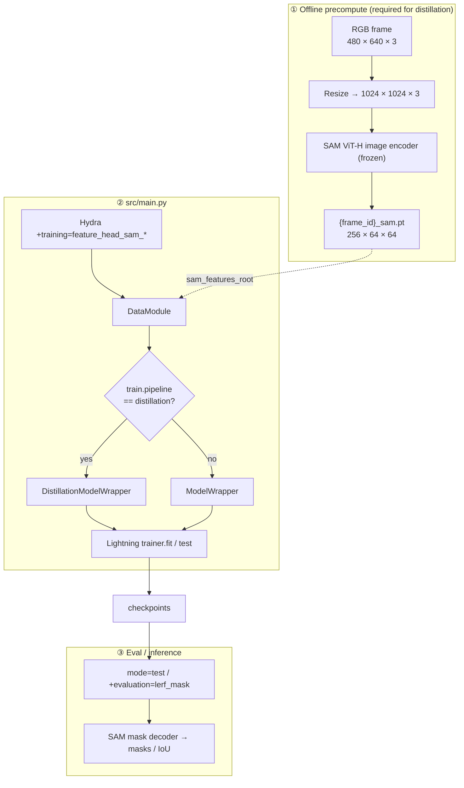

### Routing in `main.py`

```python
use_distillation = cfg.train.pipeline == "distillation"
```

| Branch | Wrapper | SAM encoder at train time |
|--------|---------|---------------------------|
| `pipeline: distillation` | `DistillationModelWrapper` | **Not loaded** — only `sam_features` from disk |
| else (`reproj_model: sam`, etc.) | `ModelWrapper` | Loaded unless `sam_features_root` is set (then skipped) |

### 1.1 Camera poses — does `main.py` take them?

**`src/main.py` does not take camera poses as a direct input.** There is no CLI argument, Hydra override, or function parameter in `main.py` for extrinsics or intrinsics.

What `main.py` does instead:

```python
data_module = DataModule(cfg.dataset, cfg.data_loader, step_tracker, ...)
trainer.fit(model_wrapper, datamodule=data_module, ...)   # or trainer.test(...)
```

Poses are loaded **indirectly** by the dataset stack and delivered **per batch** inside `BatchedExample`:

| Field | Shape | Role |
|-------|-------|------|
| `context.extrinsics` | `B × V_c × 4 × 4` | Camera-to-world (c2w), context frames |
| `context.intrinsics` | `B × V_c × 3 × 3` | Normalized `K` (focal length scaled to training resolution) |
| `target.extrinsics` | `B × V_t × 4 × 4` | c2w, target / query frames |
| `target.intrinsics` | `B × V_t × 3 × 3` | Normalized `K` |
| `near` / `far` | `B × V_*` | Per-view depth bounds (from bounds shim / dataset) |

**Where poses come from on disk** (ScanNet SAM example):

- Dataset config: `dataset.scannet_distill.roots` or `dataset.scannet_2dseg.roots` (Hydra only points at data roots).
- Per-frame files: e.g. `{scene}/{frame_id}.npz` with `camera_pose` and `camera_intrinsics` — see [`dataset_scannet_distill.py`](../src/dataset/dataset_scannet_distill.py).
- **View sampler** picks which frame indices are context vs target; dataset code stacks poses for those indices, applies baseline scaling / `camera_normalization`, then splits into `batch["context"]` and `batch["target"]`.

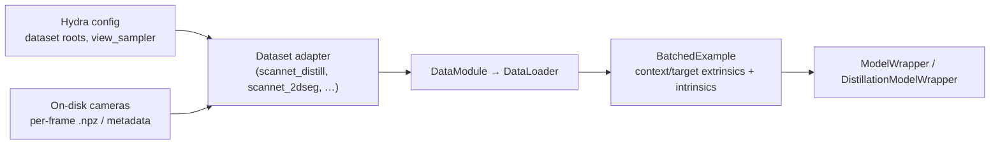

**Yes, poses are supposed to be used** — but by the **model inside the training loop**, not by `main.py` itself:

| Component | Uses poses? | How (C3G-SAM, `pose_free: true`) |
|-----------|-------------|----------------------------------|
| **`main.py`** | No | Only wires DataModule + Trainer |
| **Encoder** | **No** in forward | `pose_free: true` → Gaussians from anchor + predicted offsets, not ray casting from `context.extrinsics` |
| **Decoder / rasterizer** | **Yes** | `decoder.forward(gaussians, extrinsics, intrinsics, near, far, …)` — renders at target (+ context) cameras |
| **Test `align_pose`** | **Yes** (optional) | If `mode=test` and `test.align_pose=true`, [`main.py`](../src/main.py) sets `inference_mode=False` so poses can be refined per scene before render |

So you do **not** pass poses into `python -m src.main`; you point Hydra at a dataset that **already contains** calibrated cameras. If poses are missing or wrong on disk, training/eval will fail or degrade — that is a **data preparation** issue, not something `main.py` configures per run.

**LERF / special eval:** [`dataset_lerf_mask.py`](../src/dataset/dataset_lerf_mask.py) loads poses from the LERF-Mask layout the same way — still via DataModule, not `main.py`.

---

## 2. Data tensors

### Per-batch layout (`BatchedExample`)

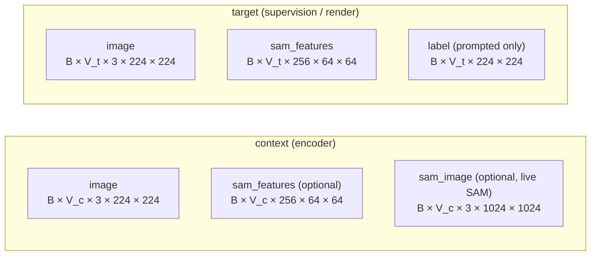

**Dual-resolution (ScanNet `scannet_2dseg`):**

- `image`: resized to `input_image_shape` (224×224) for VGGT and rasterizer.
- `sam_image`: full SAM resolution 1024×1024 (only when **not** using precomputed features).
- `sam_features`: precomputed `[256, 64, 64]` from `{frame_id}_sam.pt`.

**Distillation dataset (`scannet_distill`):** provides `sam_features` only (no `label`, no `sam_image`).

### Offline precompute

Script: [`scripts/precompute_sam_features.py`](../scripts/precompute_sam_features.py)

Modal: [`src/modal/precompute.py`](../src/modal/precompute.py)

```
RGB (any size) → resize 1024×1024 → SAM ViT-H encoder → save [256, 64, 64]
```

Volume layout: `precompute_sam_features/scannet/<scene_id>/{frame_id}_sam.pt`

### 2.1 View selection, validation & checkpointing (SAM prompted & distillation)

`src/main.py` does **not** pick views. It builds a `DataModule` with a shared `StepTracker`; each dataset calls `view_sampler.sample()` per scene and yields `batch["context"]` / `batch["target"]`.

**Configs:** both [`feature_head_sam_precomputed`](../config/training/feature_head_sam_precomputed.yaml) (distillation, `scannet_distill`) and [`feature_head_sam_prompted_scannet`](../config/training/feature_head_sam_prompted_scannet.yaml) (prompted, `scannet_2dseg`) use **`ViewSamplerBounded`** with [`bounded_scannet_2dseg`](../config/dataset/view_sampler_dataset_specific_config/bounded_scannet_2dseg.yaml) overrides on top of [`bounded.yaml`](../config/dataset/view_sampler/bounded.yaml).

| Parameter | Value |
|-----------|-------|
| `num_context_views` (`V_c`) | 2 |
| `num_target_views` (`V_t`) | 4 (`base_view_sampler`) |
| Context gap (frames between the two context views) | random in `[1, 6]` |
| `min_distance_to_context_views` | 2 — targets must be ≥2 frames inside each context endpoint |
| `warm_up_steps` | 0 (no gap curriculum) |
| `cameras_are_circular` | false |

**Per-scene sampling** ([`view_sampler_bounded.py`](../src/dataset/view_sampler/view_sampler_bounded.py)):

1. Draw a random gap `g ∈ [1, 6]` and a random left context index; right context = left + `g`.
2. **Training:** draw `V_t` random target indices in `(left + 2, right − 2)` (open interval via `randint` bounds).
3. **Test:** all frames in `[left, right]` (dataset may subsample to `V_t` afterward).
4. Scenes with `< V_c + 1` frames or invalid poses are skipped.

**Dataset post-processing** ([`dataset_scannet_2dseg.py`](../src/dataset/dataset_scannet_2dseg.py), [`dataset_scannet_distill.py`](../src/dataset/dataset_scannet_distill.py)): if the sampler returns more targets than `V_t`, subsample without replacement; load frames as `context_indices + target_indices`; apply baseline scaling (`make_baseline_1`) and `camera_normalization`; split tensors at `num_ctx`.

**Train-time view usage** (both modes, `context_view_loss: true`):

| Stage | Context views | Target views |
|-------|---------------|--------------|
| Encoder / Instill | `V_c` context images + SAM only | not fed in |
| Decoder (train) | re-render at `V_c` context poses | render at `V_t` target poses → `V = V_t + V_c` total |
| Feature loss | supervises both rendered groups vs GT SAM | same |
| Prompted mask loss | — | `V_t` only |

`random_select_context_view` is **off** in both shipped SAM configs (multiview-only option in `ModelWrapper`).

#### Validation

| | Distillation | Prompted |
|---|--------------|----------|
| Config | `feature_head_sam_precomputed` | `feature_head_sam_prompted_scannet` |
| `trainer.val_check_interval` | **500** optimizer steps | **500** optimizer steps |
| `accumulate_grad_batches` | 2 | 6 |
| Lightning interval | 500 × accumulate = **1000** / **3000** dataloader batches | same formula |
| `max_steps` | 5001 → **~10** val epochs | same |
| `num_sanity_val_steps` | 0 | 0 |

[`val_check_interval_in_training_batches`](../src/config.py) multiplies the config value by `accumulate_grad_batches` before passing to Lightning (config counts **optimizer steps**, not raw batches).

**Val dataloader:** [`ValidationWrapper`](../src/dataset/validation_wrapper.py) with `data_loader.val.limit_batches: 80` ([`main.yaml`](../config/main.yaml)) — up to 80 random val batches (one per held-out ScanNet scene when using `val_scene_count: 80`). Batch size 6.

**Logged metrics:**

- **Distillation** ([`distillation_wrapper.validation_step`](../src/model/distillation_wrapper.py)): `val/feature_cosine`, `val/feature_mag` (no `val/loss`; checkpointing does not use val metrics).
- **Prompted** ([`model_wrapper.validation_step`](../src/model/model_wrapper.py)): `val/loss` (total prompted objective), `val/feature_rendering_loss`, `val/prompted_segmentation`, `val/sam_miou`, `val/sam_boundary_miou`, plus `val/psnr` / `val/lpips` / `val/ssim` on target RGB. Primary render for image metrics is **target views only**; `val/loss` uses the same multi-view render as training (`V_t + V_c`).

#### Checkpointing

All runs write to `outputs/.../checkpoints/` via Lightning [`ModelCheckpoint`](../src/main.py) (`save_last=True` always).

| | Distillation (`feature_head_sam_precomputed`) | Prompted (`feature_head_sam_prompted_scannet`) |
|---|-----------------------------------------------|------------------------------------------------|
| `every_n_train_steps` | **50** — periodic step saves | **not set** — no step-interval saves |
| `monitor` / `mode` | `info/global_step` / **max** (default) | **`val/loss`** / **min** |
| `save_top_k` | 20 | 5 |
| What gets kept | Top-20 highest-step checkpoints + `last` + every-50-step snapshots | Top-5 lowest `val/loss` + `last` |

Distillation logs `info/global_step` each training step ([`distillation_wrapper.training_step`](../src/model/distillation_wrapper.py)) so `ModelCheckpoint` can rank by step. Prompted ranks on validation loss after each val epoch (`val/loss` from `_compute_prompted_losses`). Neither SAM config overrides `save_weights_only` (full checkpoints, not weights-only).

---

## 3. Gaussian encoder (`EncoderVGGT`)

Config: `model.encoder.name: vggt` with `gaussian_feature_dim: 256`, `num_gaussians: 2048`, `pose_free: true`, `sh_degree: 0`.

Implementation: [`src/model/encoder/encoder_vggt.py`](../src/model/encoder/encoder_vggt.py)

### 3.1 Full encoder diagram

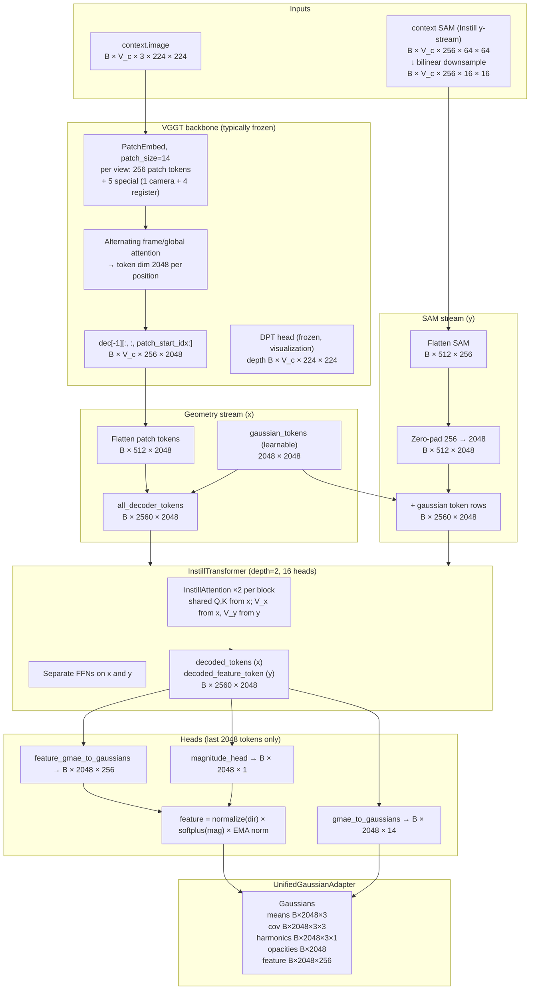

### 3.2 VGGT backbone

- **Class:** `BackboneVGGT` — [`src/model/encoder/backbone/backbone_vggt.py`](../src/model/encoder/backbone/backbone_vggt.py)
- **Aggregator:** [`src/model/encoder/backbone/vggt/aggregator.py`](../src/model/encoder/backbone/vggt/aggregator.py)
- `patch_start_idx = 1 + num_register_tokens` → **5** special tokens, then **256** patch tokens per view.
- Output used by encoder: `dec[-1][:, :, 5:]` → **`B × V_c × 256 × 2048`**, flattened to **`B × (V_c·256) × 2048`**.

### 3.3 SAM features for Instill

SAM spatial size is **64×64**, but Instill requires the **same token count as VGGT patches** per view: **16×16 = 256**.

[`downsample_sam_for_encoder`](../src/misc/sam_features.py) bilinearly resizes:

```
[B, V_c, 256, 64, 64]  →  [B, V_c, 256, 16, 16]  →  flatten  →  [B, 512, 256]
```

Then padded to `D=2048` and concatenated with duplicated `gaussian_tokens` rows so **y** aligns 1:1 with **x** (`B × 2560 × 2048`). See [`encoder_vggt.py` forward](../src/model/encoder/encoder_vggt.py) (lines ~228–259).

**Live SAM path** (when no precompute): `ModelWrapper.forward_foundation_model` runs frozen `sam_encoder` on `sam_image` `[B, V, 3, 1024, 1024]` → `[B, V, 256, 64, 64]`, then same downsample/interpolate to patch grid.

### 3.4 InstillTransformer — what each stream does and why

Implementation: [`src/model/encoder/common/gmae.py`](../src/model/encoder/common/gmae.py)

Used when `encoder.feature_dim > 0` (set to `gaussian_feature_dim` for distillation in `main.py`, or from `load_foundation_model` when `feature_rendering_loss > 0`).

Instill replaces the plain `Transformer` decoder when distilling a vision foundation model (SAM, DINO, etc.). The name reflects the design goal: **instill** VFM semantics into a fixed set of 2048 Gaussian *slots* without re-learning the whole 3D scaffold from scratch.

#### Geometry stream (**x**) — 3D scaffold + RGB, not SAM semantics

**Inputs:** VGGT patch tokens + learnable `gaussian_tokens` → `all_decoder_tokens` `[B, 2560, 2048]`.

**What it learns / predicts:**

| Output (via `gmae_to_gaussians`) | Becomes | Role |
|----------------------------------|---------|------|
| Δxyz (3) + anchor `[0,0,1]` | `means` `[B, 2048, 3]` | **Where** each Gaussian lives in pose-free 3D space |
| density (1) | `opacities` | **How visible** each Gaussian is |
| scales (3) + quaternion (4) | `covariances` `[B, 2048, 3, 3]` | **Shape** (size + orientation) of each splat |
| SH coeffs (3×`d_sh`) | `harmonics` | **RGB color** when the rasterizer α-blends splats (`output.color`) |

So the geometry stream is responsible for **placement, extent, opacity, and rendered RGB** — the standard C3G Gaussian scene. It is **not** predicting SAM segmentation masks or SAM feature maps directly.

In C3G-SAM configs this stream is mostly **frozen** (`freeze_geometry_head`, `freeze_instill_qk`, pretrained `gaussian_decoder.ckpt`): the model keeps a stable 3D layout learned before SAM training, and only the feature pathway is updated.

#### Feature stream (**y**) — SAM semantic vectors, not colors

**Inputs:** Downsampled SAM encoder features (256-d per patch location) + the same `gaussian_tokens` rows → `context_feature` `[B, 2560, 2048]`.

**What it learns / predicts:**

| Output | Shape | Role |
|--------|-------|------|
| `feature_gmae_to_gaussians` | `B × 2048 × 256` | Direction in SAM embedding space |
| `magnitude_head` | `B × 2048 × 1` | Scale (matched to target SAM norm via EMA) |
| Combined | `B × 2048 × 256` | Per-Gaussian **semantic feature** carried by each splat |

These vectors live in the same 256-dimensional space as SAM’s image-encoder output. They are **not RGB colors**. After rasterization they form `output.feature` `[B, V, 256, H, W]`, which is compared to SAM features (distillation) or passed to the frozen SAM **mask decoder** (prompted segmentation).

Think of it as: geometry stream = *where and how to splat for RGB/depth*; feature stream = *what SAM would have encoded at each 3D location*.

#### Why two streams instead of one?

1. **Reuse pretrained geometry.** C3G already predicts a compact 2048-Gaussian scene from VGGT patches. SAM training only needs to attach VFM semantics to those slots, not relearn layout from SAM features alone.
2. **Different modalities.** VGGT patches encode multi-view geometry; SAM patches encode segmentation-oriented semantics. A single stream would entangle gradients and destabilize the frozen scaffold.
3. **Shared Q/K coupling.** `InstillAttention` uses the **same** queries and keys from **x** for both streams, but **separate value projections** (`V` from x, `another_v` from y). SAM tokens therefore attend with the **same spatial indexing** as VGGT patch tokens, aligning “this Gaussian slot” with “this image region’s SAM embedding” without overwriting geometry representations.
4. **Independent gradient control.** In SAM training, geometry is detached before the rasterizer and `feature_detach=True` in the decoder, so feature losses train the y-stream and per-Gaussian `feature` vectors without moving means/covariance/opacities.

**One `InstillAttention` block:**

```
x: B × 2560 × 2048          y: B × 2560 × 2048
         │                            │
    Q, K, V = Linear(x)          another_v = Linear(y)
         │                            │
    x_out = Attn(Q, K, V)        y_out = Attn(Q, K, another_v)   ← shared Q, K
         │                            │
    x ← x + x_out + FF_x(x)      y ← y + y_out + FF_y(y)
```

Only the **last `N_g = 2048` rows** (the Gaussian token slots, not the 512 patch rows) are passed to the output heads.

| Stream | Head(s) | Trained in typical SAM config? |
|--------|---------|--------------------------------|
| **x** (geometry) | `gmae_to_gaussians` | Frozen (`freeze_geometry_head`) |
| **y** (SAM) | `feature_gmae_to_gaussians`, `magnitude_head`, Instill `V_y` / FFN_y | Yes |

**Depth:** `decoder_depth = 2` (two Instill blocks).

### 3.5 Gaussian parameter heads

| Head | Input | Output | Notes |
|------|-------|--------|-------|
| `gmae_to_gaussians` | Last `N_g` rows of **x** | `B × 2048 × 14` | `raw_gs_dim = 3+1+d_in`, `d_in=10` for `sh_degree=0` |
| `feature_gmae_to_gaussians` | Last `N_g` rows of **y** | `B × 2048 × 256` | Per-Gaussian SAM feature |
| `magnitude_head` | Last `N_g` rows of **y** | `B × 2048 × 1` | `softplus` × `feature_norm_ema` |

**`raw_gs_dim` breakdown (sh_degree=0):** Δxyz (3) + density (1) + scales (3) + quaternion (4) + SH coeffs (3×1) = **14**.

**Feature vector:** `direction = normalize(256-d)`; `feature = direction * softplus(magnitude) * EMA_norm`.

### 3.6 `UnifiedGaussianAdapter` — do both streams go through it?

[`src/model/encoder/common/gaussian_adapter.py`](../src/model/encoder/common/gaussian_adapter.py)

**Short answer:** `UnifiedGaussianAdapter` is called **once**, but the two streams take **different paths** into it. Geometry parameters are parsed and converted inside the adapter; SAM feature vectors are passed in as a separate `features=` argument and are **not** mixed with scales/quaternions/SH.

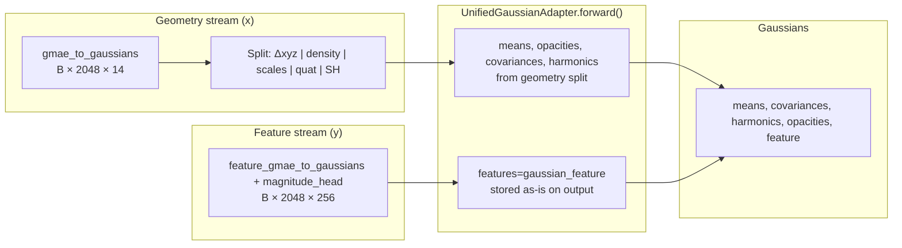

**Call site** ([`encoder_vggt.py`](../src/model/encoder/encoder_vggt.py)):

```python
gaussians = self.gaussian_adapter.forward(
    pts_all,                          # means — from geometry Δxyz + anchor
    depths,                           # from geometry
    self.map_pdf_to_opacity(densities, global_step),  # from geometry density
    rearrange(gaussians[..., 1:], ...),  # raw scales + quat + SH — geometry only
    features=gaussian_feature,          # B × 2048 × 256 — feature stream only
)
```

| `Gaussians` field | Source stream | Processed by adapter? |
|-------------------|---------------|------------------------|
| `means` | Geometry (Δxyz + `anchor_positions`) | Yes — direct / depth-based |
| `covariances` | Geometry (scales + quaternion) | Yes — `build_covariance` |
| `harmonics` | Geometry (SH coeffs) | Yes — masked by `sh_mask` |
| `opacities` | Geometry (density) | Yes — `opacity_mapping` |
| `feature` | Feature stream only | **No parsing** — attached unchanged |

After the adapter, all five tensors are packed into the final [`Gaussians`](../src/model/types.py) dataclass and sent to the rasterizer. The CUDA kernel uses **harmonics** for `output.color` and **feature** for `output.feature` in separate α-blending passes.

See [§4.1](#41-feature-stream-lifecycle-adapter-rasterizer-and-sam-mask-decoder) for the full path from feature stream → adapter → rasterizer → losses vs SAM mask decoder.

**`sh_degree=0` in SAM configs:** harmonics are minimal (`B × 2048 × 3 × 1`), so RGB supervision is coarse; the main SAM-specific signal is in the **256-d feature render**, not in SH color.

---

## 4. Decoder & CUDA rasterizer

**Class:** `DecoderSplattingCUDA` — [`src/model/decoder/decoder_splatting_cuda.py`](../src/model/decoder/decoder_splatting_cuda.py)

**Kernel:** `render_cuda` — [`src/model/decoder/cuda_splatting.py`](../src/model/decoder/cuda_splatting.py)

Uses `FeatureDetachGaussianRasterizer` when Gaussian **features** are present.

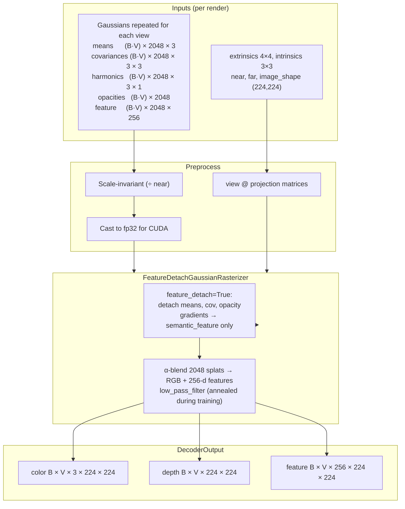

**Per-view loop:** batch dimension `(B·V)`; each view splats all `G=2048` Gaussians into a `224×224` framebuffer.

**SAM training configs:** `feature_detach: true` in decoder — geometry does not receive gradients from feature rendering; encoder also **detaches** Gaussian geometry in distillation / prompted modes before decode.

### 4.1 Feature-stream lifecycle: adapter, rasterizer, and SAM mask decoder

A common point of confusion: there are **two different SAM-related tensors** in the pipeline. They are not the same object and do not follow the same path.

| Tensor | When | Shape (typical) | Used where |
|--------|------|-----------------|------------|
| **Input SAM** (`context.sam_features` or live `sam_encoder`) | Encoder only | `B × V_c × 256 × 64×64` → downsampled to patch grid | Instill **y-stream** (conditions feature-token updates) |
| **Per-Gaussian SAM** (`Gaussians.feature`) | After encoder | `B × 2048 × 256` | `UnifiedGaussianAdapter` (passthrough) → **rasterizer** → `output.feature` |

#### Does the feature stream feed the adapter and rasterizer?

**Yes — mechanistically it must.** The SAM mask decoder is **not** the only consumer.

1. **Instill y-stream** → `feature_gmae_to_gaussians` + `magnitude_head` → `gaussian_feature` `[B, 2048, 256]`.
2. **`UnifiedGaussianAdapter`** — `features=gaussian_feature` is stored on the output dataclass. The adapter does not parse or transform these vectors (no scale/quat/SH split), but they **are part of** `Gaussians` passed to the decoder.
3. **`FeatureDetachGaussianRasterizer`** — each Gaussian’s `semantic_feature` vector `[256]` is projected and **α-blended** into a 2D map, the same way SH coefficients produce RGB. Output: `output.feature` `[B, V, 256, 224, 224]`.

Without steps 2–3, there is no differentiable path from the feature stream to training losses. The rasterizer is the mechanism that **lifts** per-Gaussian SAM vectors into view-space SAM embedding maps.

The **geometry stream** alone drives `means`, `covariances`, `harmonics`, `opacities` and the RGB/depth render. The **feature stream** alone drives `Gaussians.feature` and the feature render. They share Instill attention but split before the adapter heads.

#### Does the rasterizer output go into the SAM mask decoder?

**Sometimes — not always.** After rasterization, `output.feature` can branch to **three** consumers:

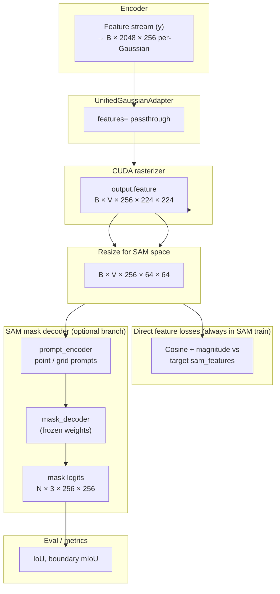

| Consumer | Distillation training | Prompted training | Eval |
|----------|----------------------|-------------------|------|
| **Direct cosine / magnitude loss** vs GT `sam_features` | **Yes** (main loss) | **Yes** (`feature_rendering_loss`) | No |
| **SAM mask decoder** | **No** (debug W&B viz only) | **Yes** (`prompted_segmentation` loss) | **Yes** (LERF / mask export) |
| **RGB / MSE losses** on `output.color` | Optional | If configured | Optional |

So: **distillation never backprops through the SAM mask decoder** during training. It supervises rendered features **directly** against precomputed SAM maps. The mask decoder is only wired in for visualization (distill) or extra segmentation supervision / inference (prompted / eval).

#### How the SAM mask decoder step works

Wrapper: [`SAMMaskDecoderWrapper`](../src/model/sam_decoder.py). It reuses the **frozen** `prompt_encoder` and `mask_decoder` weights from the official SAM checkpoint, but replaces the usual SAM **image encoder** output with **C3G’s rendered feature map**.

In vanilla SAM the flow is:

```
RGB → SAM image encoder → image_embeddings [1, 256, 64, 64]
      → mask_decoder(image_embeddings, prompt_embeddings) → masks
```

In C3G-SAM the flow is:

```
3D Gaussians.feature → rasterizer → rendered_features [B, 256, H, W]
      → bilinear resize to 64×64 if needed
      → treat as image_embeddings
      → prompt_encoder(points/boxes/grid) → sparse + dense prompt embeddings
      → mask_decoder(image_embeddings=rendered, prompts) → low-res mask logits
```

**Step-by-step** (prompted loss or eval):

1. **Rasterizer** produces `output.feature` `[B, V, 256, 224, 224]` (or subset of views).
2. **Resize** to SAM embedding resolution: `F.interpolate(..., size=(64, 64))` → `[N, 256, 64, 64]` where `N` is the number of (batch, view) samples in the loss loop.
3. **`SAMMaskDecoderWrapper.forward(rendered_features)`** — if `H,W ≠ 64`, interpolates internally (same as step 2).
4. **`prompt_encoder`** encodes prompts:
   - **Prompted training:** one foreground point per object from GT `label` (`PromptSampler`, centroid strategy) → `sparse_prompt_embeddings`.
   - **Eval / segment-everything:** `8×8` grid points if no prompts (`GRID_SIZE=8`).
5. **`mask_decoder`** (SAM’s transformer) cross-attends prompt tokens with the **rendered** `image_embeddings` and outputs **3 mask hypotheses** per prompt: `[N, 3, 256, 256]` logits (low resolution; not full 224×224).
6. **Loss / metrics:** `LossSegmentationPrompted` picks the best of the 3 masks via BCE+Dice; eval compares logits to GT masks for IoU.

Important details:

- The wrapper docstring states it accepts **“rendered Gaussian features (B×256×64×64)”** — it expects SAM-shaped embeddings, not RGB.
- Gradients in prompted training flow: `prompted_seg_loss` → mask decoder (frozen, no grad into SAM weights) → **rendered features** → rasterizer → **per-Gaussian `feature`** → feature stream. Geometry stays detached.
- `decode_sam_mask_logits()` in [`model_wrapper.py`](../src/model/model_wrapper.py) is the eval helper: `rearrange(output.feature, "b v c h w -> (b v) c h w")` then `mask_decoder(features_flat)`.

#### One-sentence summary

The feature stream produces **per-Gaussian SAM vectors** that pass through the adapter (unchanged) and are **splatted by the rasterizer** into 2D feature maps; those maps are **directly matched to SAM** for distillation, and **optionally** passed through the frozen SAM **mask decoder** when training prompted segmentation or running mask eval — the mask decoder does not replace the rasterizer, it sits **on top of** the rasterizer output.

---

## 5. Training modes

### 5.1 End-to-end shape trace (one step)

```
┌─────────────────────────────────────────────────────────────────────────────┐
│ DATA                                                                        │
│  context.image        [B, V_c,  3, 224, 224]                              │
│  target.image         [B, V_t,  3, 224, 224]                              │
│  context.sam_features [B, V_c, 256,  64,  64] → downsample → [B,V_c,256,16,16]│
│  target.sam_features  [B, V_t, 256,  64,  64]  (loss at full SAM res)     │
└─────────────────────────────────────────────────────────────────────────────┘
                                    │
                                    ▼
┌─────────────────────────────────────────────────────────────────────────────┐
│ ENCODER                                                                     │
│  x: [B, 2560, 2048]  +  y: [B, 2560, 2048]  → InstillTransformer ×2       │
│  → Gaussians: means [B,2048,3]  cov [B,2048,3,3]  feat [B,2048,256]       │
└─────────────────────────────────────────────────────────────────────────────┘
                                    │
                                    ▼
┌─────────────────────────────────────────────────────────────────────────────┐
│ DECODER (V = V_t + V_c views when context_view_loss)                        │
│  color   [B, V,  3, 224, 224]                                              │
│  feature [B, V, 256, 224, 224]  ──upsample──► [B, V, 256, 64, 64]         │
└─────────────────────────────────────────────────────────────────────────────┘
```

### 5.2 Distillation (`DistillationModelWrapper`)

[`src/model/distillation_wrapper.py`](../src/model/distillation_wrapper.py)

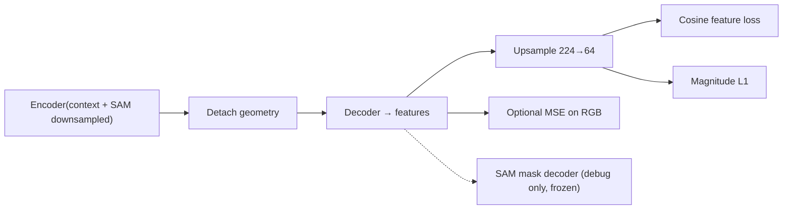

| Loss | Compares | Weight (default config) |
|------|----------|-------------------------|
| `feature_cosine` | Rendered vs SAM at **64×64** | `feature_cosine_loss_weight: 1.0` |
| `feature_magnitude` | L1 on channel norms | `feature_mag_loss_weight: 0.5` |
| MSE (optional) | RGB render vs GT | from `loss: [mse]` |

Equations: [§5.4](#54-training-loss-mathematics).

### 5.3 Prompted SAM (`ModelWrapper`)

[`src/model/model_wrapper.py`](../src/model/model_wrapper.py)

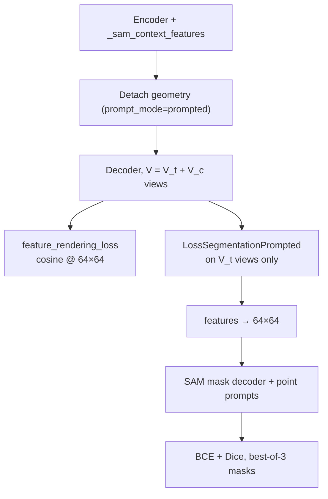

| Loss | Shapes | Notes |
|------|--------|-------|
| `feature_rendering_loss` | rendered `[B,V,256,64,64]` vs SAM | weight `1.0` in prompted ScanNet config |
| `prompted_segmentation` | `[N,256,64,64]` → masks `[N,3,256,256]` | [`loss_segmentation_prompted.py`](../src/loss/loss_segmentation_prompted.py) |
| `mse` / `lpips` | rendered `color` vs GT RGB | Hydra `loss: [mse, lpips]` (weights from [`config/loss/`](../config/loss/)) |

**Prompted segmentation:** GT `label` maps decomposed into binary masks; `PromptSampler` yields point coords/labels; frozen `SAMMaskDecoderWrapper` predicts 3 mask hypotheses; best BCE+Dice is kept.

See [§5.4](#54-training-loss-mathematics) for the full equations.

### 5.4 Training loss mathematics

[`src/main.py`](../src/main.py) does not implement losses directly; it routes to one of two Lightning wrappers based on `train.pipeline`:

```python
use_distillation = cfg.train.pipeline == "distillation"
# distillation  → DistillationModelWrapper
# else          → ModelWrapper  (prompted C3G-SAM when prompt_mode=prompted)
```

Both paths share the same **render → upsample → compare** pattern for feature supervision. Let subscripts index batch `b`, view `v`, channel `c`, and spatial `(h,w)`.

#### Shared rendering notation

The encoder builds 3D Gaussians from **context** views only. Before the decoder, **geometry is detached** so feature losses train the Instill value stream and per-Gaussian `feature` vectors without moving means / covariances / opacities:

```python
gaussians_detached = Gaussians(..., feature=gaussians.feature)  # means/cov/harmonics/opacities .detach()
```

The rasterizer produces `output.feature` with shape `[B, V, C, H, W]` where `H=W=224` and `C=256`. For loss, features are bilinearly upsampled to SAM resolution `64×64`:

\[
\hat{\mathbf{f}}_{b,v,h,w} = \text{Interp}_{224\to64}\!\big(\text{raster}(\text{Gaussians})_{b,v,\cdot,h,w}\big) \in \mathbb{R}^{C}
\]

Ground-truth SAM maps are \(\mathbf{f}^{\text{gt}}_{b,v,h,w} \in \mathbb{R}^{C}\) (from disk or live encoder). When `context_view_loss=true` (default in both ScanNet configs), views are concatenated **target-first**:

\[
V = V_t + V_c, \quad \mathbf{f}^{\text{gt}} = \text{concat}(\mathbf{f}^{\text{target}}, \mathbf{f}^{\text{context}}), \quad \hat{\mathbf{f}} \text{ uses the same view order.}
\]

Distillation crops both tensors to the valid SAM region (currently the full `64×64` grid). Prompted feature loss merges context+target SAM via [`_sam_features_for_loss`](../src/model/model_wrapper.py) and [`reorder_context_target`](../src/misc/sam_features.py) to match render order.

#### Distillation objective (`DistillationModelWrapper`)

Implemented in [`distillation_wrapper.py`](../src/model/distillation_wrapper.py) (`compute_feature_losses`, `training_step`).

**Cosine (direction) loss** — per-pixel \(\ell_2\)-normalize along the channel axis, then one minus dot product, averaged over all pixels and views:

\[
\mathcal{L}_{\text{cos}} = \frac{1}{B\,V\,H_s\,W_s} \sum_{b,v,h,w}
\left(
1 - \frac{\hat{\mathbf{f}}_{b,v,h,w}^{\top}\,\mathbf{f}^{\text{gt}}_{b,v,h,w}}
{\|\hat{\mathbf{f}}_{b,v,h,w}\|_2\,\|\mathbf{f}^{\text{gt}}_{b,v,h,w}\|_2 + \varepsilon}
\right)
\]

with \(\varepsilon = 10^{-8}\). Equivalent to `F.cosine_similarity(..., dim=2)` then `(1 - sim).mean()`.

**Magnitude loss** — L1 on per-pixel channel norms (matches SAM embedding scale, not just direction):

\[
\mathcal{L}_{\text{mag}} = \frac{1}{B\,V\,H_s\,W_s} \sum_{b,v,h,w}
\left|
\|\hat{\mathbf{f}}_{b,v,h,w}\|_2 - \|\mathbf{f}^{\text{gt}}_{b,v,h,w}\|_2
\right|
\]

**Optional RGB MSE** — from Hydra `loss: [mse]` ([`loss_mse.py`](../src/loss/loss_mse.py)); compares rendered `output.color` to GT images (target + context when `context_view_loss=true`):

\[
\mathcal{L}_{\text{mse}} = w_{\text{mse}} \cdot \frac{1}{B\,V\,3\,H\,W} \sum_{b,v,c,h,w} \big(\hat{I}_{b,v,c,h,w} - I^{\text{gt}}_{b,v,c,h,w}\big)^2
\]

**Total distillation loss:**

\[
\boxed{
\mathcal{L}_{\text{distill}} =
w_{\text{cos}}\,\mathcal{L}_{\text{cos}}
+ w_{\text{mag}}\,\mathcal{L}_{\text{mag}}
+ \mathcal{L}_{\text{mse}}
}
\]

| Symbol | Config key | ScanNet default (`feature_head_sam_precomputed`) |
|--------|------------|-----------------------------------------------|
| \(w_{\text{cos}}\) | `train.feature_cosine_loss_weight` | `1.0` |
| \(w_{\text{mag}}\) | `train.feature_mag_loss_weight` | `0.5` |
| \(w_{\text{mse}}\) | `loss.mse.weight` | from `loss: [mse]` default |

Code defaults (if keys omitted): `feature_cosine_loss_weight=1.0`, `feature_mag_loss_weight=0.1`.

**No SAM mask decoder in the loss** — distillation never backprops through `SAMMaskDecoderWrapper`; it only supervises rendered embeddings directly against precomputed SAM maps.

#### Prompted C3G-SAM objective (`ModelWrapper`)

Implemented in [`model_wrapper.py`](../src/model/model_wrapper.py) + [`loss_segmentation_prompted.py`](../src/loss/loss_segmentation_prompted.py).

**Feature rendering loss** (`train.feature_rendering_loss > 0`) — same cosine form as distillation, but GT SAM is **stopped** (`feature.detach()`) so gradients cannot flow into the frozen / precomputed SAM encoder:

\[
\mathcal{L}_{\text{feat}} = \frac{1}{B\,V\,H_s\,W_s} \sum_{b,v,h,w}
\left(
1 - \frac{\hat{\mathbf{f}}_{b,v,h,w}^{\top}\,\text{stopgrad}(\mathbf{f}^{\text{gt}}_{b,v,h,w})}
{\|\hat{\mathbf{f}}_{b,v,h,w}\|_2\,\|\mathbf{f}^{\text{gt}}_{b,v,h,w}\|_2}
\right)
\]

There is **no magnitude term** in the prompted ScanNet config (`feature_head_sam_prompted_scannet`).

**Prompted segmentation loss** — only **target** rendered views (`prediction.feature[:, :V_t]`). For each batch index `b` and target view `v`:

1. Decompose GT label map into \(K\) binary masks (one per non-background class id).
2. Filter masks with \(\geq\) `min_object_pixels` foreground pixels.
3. [`PromptSampler`](../src/model/prompt_sampler.py) picks **one** random valid object and returns a foreground point \((x,y)\) (centroid strategy) plus its binary mask \(\mathbf{y}\).
4. Resize rendered features to \(64\times64\); run frozen `SAMMaskDecoderWrapper` → **3** mask logit maps \(\mathbf{m}^{(k)} \in \mathbb{R}^{256\times256}\), \(k \in \{1,2,3\}\) (SAM multimask output).

Per sample \(n\) (one per valid \((b,v)\) pair), define pixel-wise BCE-with-logits and soft Dice on each hypothesis:

\[
\mathcal{L}_{\text{BCE}}^{(n,k)} = \text{mean}_{p}\,\text{BCEWithLogits}\!\big(\mathbf{m}^{(n,k)}_p,\, y^{(n)}_p\big)
\]

\[
\mathcal{L}_{\text{Dice}}^{(n,k)} = 1 - \frac{2\sum_p \sigma(\mathbf{m}^{(n,k)}_p)\, y^{(n)}_p + 1}
{\sum_p \sigma(\mathbf{m}^{(n,k)}_p) + \sum_p y^{(n)}_p + 1}
\]

**Best-of-3** (SAM ambiguity head — keep the hypothesis with lowest combined loss):

\[
\mathcal{L}_{\text{seg}}^{(n)} = \min_{k \in \{1,2,3\}} \big(\mathcal{L}_{\text{BCE}}^{(n,k)} + \mathcal{L}_{\text{Dice}}^{(n,k)}\big)
\]

\[
\mathcal{L}_{\text{prompted}} = w_{\text{seg}} \cdot \frac{1}{N} \sum_{n=1}^{N} \mathcal{L}_{\text{seg}}^{(n)}
\]

where \(N\) is the number of valid \((b,v)\) samples (zero if all labels are background → loss returns `0` with `requires_grad=True`).

**Optional RGB losses** — from Hydra `loss: [mse, lpips]` ([`config/main.yaml`](../config/main.yaml) defaults). These are wired through the same `for loss_fn in self.losses` loop in [`model_wrapper.py`](../src/model/model_wrapper.py) **before** feature and mask terms. GT images are concatenated **target-first** over \(V = V_t + V_c\) views:

\[
I^{\text{gt}}_{b,v} =
\begin{cases}
\text{batch["target"]["image"]}_{b,v} & v < V_t \\
\frac{1}{2}\big(\text{batch["context"]["image"]}_{b,v} + 1\big) & v \geq V_t
\end{cases}
\]

(context images are stored in \([-1,1]\); they are remapped to \([0,1]\) for RGB supervision.)

**MSE** ([`loss_mse.py`](../src/loss/loss_mse.py)) on rendered `output.color` \(\hat{I}\) — the loss module returns the weighted value:

\[
\mathcal{L}_{\text{mse}} = w_{\text{mse}} \cdot \frac{1}{B\,V\,3\,H\,W} \sum_{b,v,c,h,w} \big(\hat{I}_{b,v,c,h,w} - I^{\text{gt}}_{b,v,c,h,w}\big)^2
\]

**LPIPS** ([`loss_lpips.py`](../src/loss/loss_lpips.py)) — frozen VGG-based perceptual distance, `normalize=True`, averaged over all \(B \cdot V\) views. Zero until `global_step ≥ apply_after_step`:

\[
\mathcal{L}_{\text{lpips}} =
\begin{cases}
w_{\text{lpips}} \cdot \text{mean}_{b,v}\,\text{LPIPS}\!\big(\hat{I}_{b,v},\, I^{\text{gt}}_{b,v}\big) & \text{step} \geq \text{apply\_after\_step} \\
0 & \text{otherwise}
\end{cases}
\]

**Total prompted loss** (full objective when `loss: [mse, lpips]` is enabled):

\[
\boxed{
\mathcal{L}_{\text{prompted total}} =
\mathcal{L}_{\text{mse}}
+ \mathcal{L}_{\text{lpips}}
+ w_{\text{feat}}\,\mathcal{L}_{\text{feat}}
+ \mathcal{L}_{\text{prompted}}
}
\]

where \(\mathcal{L}_{\text{feat}}\) is the **unweighted** cosine mean above, \(\mathcal{L}_{\text{prompted}} = w_{\text{seg}} \cdot \frac{1}{N} \sum_{n} \mathcal{L}_{\text{seg}}^{(n)}\) (weight applied inside [`LossSegmentationPrompted`](../src/loss/loss_segmentation_prompted.py)), and \(\mathcal{L}_{\text{mse}}, \mathcal{L}_{\text{lpips}}\) already include \(w_{\text{mse}}, w_{\text{lpips}}\) from the `loss:` configs — matching the summation order in `ModelWrapper.training_step`.

| Symbol | Config key | Shipped prompted default |
|--------|------------|--------------------------|
| \(w_{\text{feat}}\) | `train.feature_rendering_loss` | `1.0` |
| \(w_{\text{seg}}\) | `train.prompted_seg_loss_weight` | `0.1` |
| \(w_{\text{mse}}\) | `loss.mse.weight` | `1.0` ([`config/loss/mse.yaml`](../config/loss/mse.yaml)) |
| \(w_{\text{lpips}}\) | `loss.lpips.weight` | `0.05` ([`config/loss/lpips.yaml`](../config/loss/lpips.yaml)) |
| LPIPS delay | `loss.lpips.apply_after_step` | `0` |

Shipped prompted configs [`feature_head_sam_prompted_scannet.yaml`](../config/training/feature_head_sam_prompted_scannet.yaml) and [`feature_head_sam_prompted.yaml`](../config/training/feature_head_sam_prompted.yaml) include `loss: [mse, lpips]` alongside \(\mathcal{L}_{\text{feat}}\) and \(\mathcal{L}_{\text{prompted}}\). Omit RGB terms with `override /loss: []` if desired.

**Gradient note:** when `prompt_mode=prompted`, Gaussian **geometry and harmonics are detached** before the decoder, so \(\mathcal{L}_{\text{mse}}\) and \(\mathcal{L}_{\text{lpips}}\) are included in `loss/total` but **do not backprop into the encoder** — only \(\mathcal{L}_{\text{feat}}\) and the mask path train Instill / per-Gaussian `feature`. RGB losses matter when geometry is *not* detached (e.g. non-prompted `feature_head_sam` with `loss: [mse, lpips]`).

#### Gradient flow (what is trained)

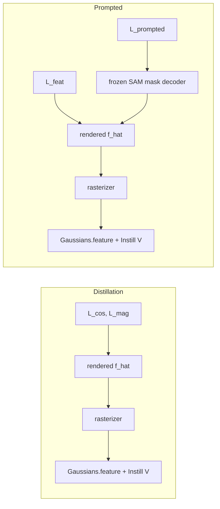

| Quantity | Receives gradients from feature / mask losses? |
|----------|-----------------------------------------------|
| Per-Gaussian `feature`, Instill V-stream, feature heads | **Yes** |
| Gaussian means, covariances, opacities, harmonics | **No** (detached before decode) |
| VGGT backbone, DPT geometry head, Instill Q/K | **No** (frozen) |
| SAM image encoder | **No** (not loaded or frozen; GT features detached in prompted path) |
| SAM mask decoder weights | **No** (frozen; acts as a fixed differentiable head on rendered features) |

#### Side-by-side summary

| | Distillation | Prompted C3G-SAM |
|---|--------------|------------------|
| Wrapper | `DistillationModelWrapper` | `ModelWrapper` |
| Feature supervision | \(\mathcal{L}_{\text{cos}} + \mathcal{L}_{\text{mag}}\) vs precomputed SAM | \(\mathcal{L}_{\text{feat}}\) (cosine only) vs SAM |
| RGB supervision | Optional `mse` (+ `lpips`) | Optional `mse` + `lpips` (usually omitted; no grad to encoder when geometry detached) |
| Mask supervision | None | \(\mathcal{L}_{\text{prompted}}\) (BCE + Dice, best-of-3) via frozen SAM mask decoder |
| Views in feature loss | \(V_t + V_c\) when `context_view_loss=true` | Same |
| Views in mask loss | — | \(V_t\) only |
| SAM mask decoder in loss | No | Yes (frozen) |

### 5.5 What is frozen vs trained (typical SAM config)

| Module | Distillation | Prompted |
|--------|--------------|----------|
| VGGT backbone | frozen | frozen |
| DPT head | frozen | frozen |
| Instill Q/K | frozen | frozen |
| `gmae_to_gaussians` / `gaussian_tokens` | frozen | frozen |
| Instill V + feature heads | **train** | **train** |
| SAM image encoder | not loaded | frozen (or precomputed) |
| SAM mask decoder | debug only | frozen (loss path) |
| Rasterizer geometry | detached | detached |
| Per-Gaussian `feature` | **train** | **train** |

---

## 6. Pipeline outputs — what the system produces

The pipeline has **different outputs at different stages**. Context views are almost always **inputs** to build the 3D scene; **target** (query / held-out) views are where user-facing predictions live.

### 6.1 Trained artifact (what you save)

A training run writes a **checkpoint** (encoder + feature heads). The persistent representation is:

```
Gaussians per scene inference:
  means, covariances, harmonics, opacities  — geometry stream
  feature [2048 × 256]                     — feature stream (SAM space)
```

This is **not** a mask file. Masks are produced **at query time** by rendering Gaussians at a chosen camera pose, then optionally running the SAM mask decoder.

### 6.2 Rendered outputs (per forward pass)

Given context views, the decoder can rasterize at any camera poses you pass in. **View order in training** (when both stages are rendered) is always:

```
output.*[:, 0 : V_t]  →  target views  (first)
output.*[:, V_t : V]  →  context views (last)
```

because extrinsics are concatenated as `[target, context]` in `training_step` / distillation.

| Output | Tensor shape | Which views (typical) |
|--------|--------------|------------------------|
| `output.color` | `B × V × 3 × H × W` | Depends on mode (below) |
| `output.depth` | `B × V × H × W` | Same |
| `output.feature` | `B × V × 256 × H × W` | Same |
| Segmentation masks (after SAM mask decoder) | `N × 3 × 256 × 256` logits | **Target views only** (see below) |

### 6.3 Segmentation masks: target only (not context)

**For mask export, eval, and `test_step`, masks are produced only for target views** — the frames you want to segment or score — not for context views.

| Stage | Views rasterized | Masks produced? |
|-------|------------------|-----------------|
| **`test_step`** ([`model_wrapper.py`](../src/model/model_wrapper.py)) | `batch["target"]` only (`V_t` views) | Yes — LERF / `eval_lerf_mask` on `output.feature` |
| **Mask export** ([`mask_export.py::render_target_features`](../src/evaluation/mask_export.py)) | Single **target** frame per export call | Yes — one PNG per class per target `frame_id` |
| **Prompted training loss** ([`loss_segmentation_prompted.py`](../src/loss/loss_segmentation_prompted.py)) | Decoder renders target+context, but loss uses `prediction.feature[:, :target_view_count]` | **Target only** — needs `batch["target"]["label"]` |
| **Validation `val/sam_miou`** | Primary render: **target only**; prompted val loss may use all train views for feature terms | Mask metrics on **target** `output.feature` vs `target` GT |
| **Distillation training** | Target+context renders when `context_view_loss=true` | **No masks** — only direct feature loss vs SAM maps (both view groups) |
| **Debug W&B** (`log_decoder_debug`) | Usually first **target** view | Optional mask viz |

Context images are used to **encode** the scene (`encoder(context, …)`). They are not the frames whose segmentation masks are written to disk in the standard eval/export path.

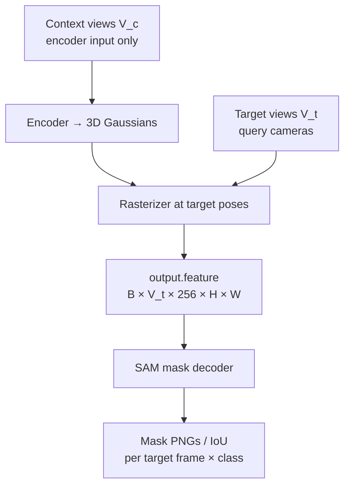

### 6.4 Training-time renders (not the final deliverable)

During **training**, the decoder often renders **both** target and context (`V = V_t + V_c`) so feature losses can supervise all rendered views:

| Loss | Views supervised |
|------|------------------|
| Distillation cosine / magnitude (`context_view_loss=true`) | **Target and context** SAM feature maps |
| `feature_rendering_loss` (prompted) | **Target and context** (reordered to target-first) |
| `prompted_segmentation` | **Target only** |
| RGB / MSE (if enabled) | **Target and context** when concatenated in `target_image` |

These multi-view training renders are **internal**; they do not mean the shipped eval pipeline exports context masks.

### 6.5 Novel views

At inference, Gaussians can be rasterized at **any** extrinsics/intrinsics you supply — not limited to dataset “target” indices. Mask export and `test_step` simply use the dataset’s **target** slot as the query camera for each evaluation frame. Context frames are never the primary mask output in those code paths.

### 6.6 Summary

| Question | Answer |
|----------|--------|
| What is the main pipeline output? | A **3D Gaussian field** (+ per-Gaussian SAM features), saved as a **checkpoint** |
| What about RGB / depth / feature maps? | **2D renders** at query camera(s): `color`, `depth`, `feature` |
| Are masks for context views? | **No** in eval, test, mask export, and prompted mask loss — **target views only** |
| Are masks for target views? | **Yes** — after rasterizer → SAM mask decoder (or direct feature metrics without masks in distillation) |
| Can context views get feature supervision in training? | **Yes**, but that supervises **rendered SAM features**, not exported segmentation masks |

### 6.7 Context vs target — are they fed into blocks the same way?

**No.** Context and target are **not symmetric**. They are split in the dataset (`batch["context"]` vs `batch["target"]`), and each pipeline stage reads from **only one side or the other** (or uses them for different roles). Including one does **not** automatically include the other in the same block.

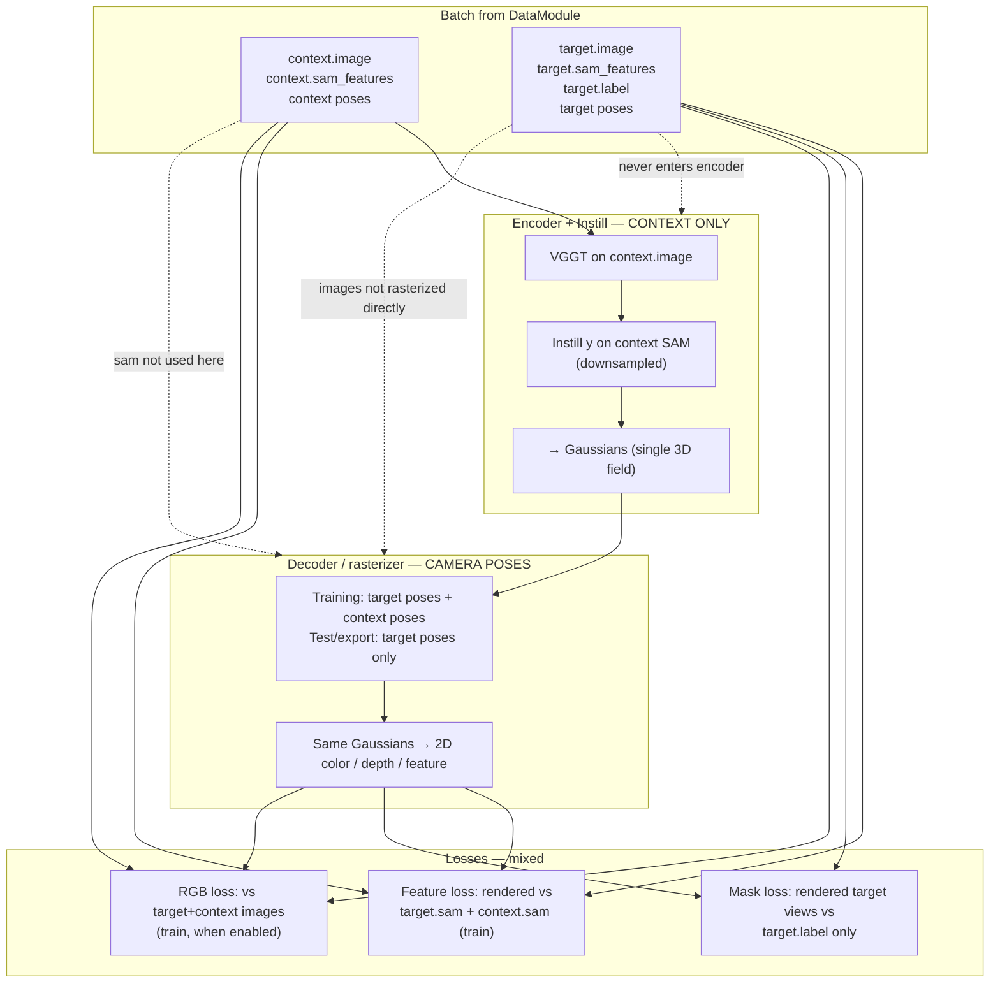

#### Per-block routing table

| Block | Context images | Target images | Context `sam_features` | Target `sam_features` | All views together? |
|-------|----------------|---------------|------------------------|----------------------|---------------------|
| **VGGT backbone** | **Yes** — sole RGB input | **No** | — | — | All **context** views in one forward (`V_c` frames) |
| **Instill y-stream** | — | — | **Yes** — downsampled, encoder only | **No** | All **context** SAM maps only |
| **Gaussian heads → adapter** | — | — | — | — | One shared `Gaussians` for the whole scene |
| **Rasterizer (train)** | — | — | — | — | **Poses**: `V_t` target + `V_c` context cameras (no images fed in) |
| **Rasterizer (test / export)** | — | — | — | — | **Poses**: `V_t` target only |
| **Distillation feature loss** | — | — | GT for loss (if `context_view_loss`) | GT for loss (always) | **Both** GT SAM maps vs **both** rendered views (target-first order) |
| **`feature_rendering_loss`** | — | — | GT (merged) | GT (merged) | **Both** — merged then reordered to match render order |
| **Prompted mask loss** | — | — | **No** | **No** (uses `target.label`, not SAM GT) | **Target render views only** |
| **SAM mask decoder** | — | — | — | — | Only **target** rendered features (in standard paths) |

#### Same mechanism, different membership

When multiple views **do** enter the same block, they are processed **the same way** (same ops, same tensor layout):

- **All context images** in VGGT: `B × V_c × 3 × H × W` — multi-view attention across context frames only.
- **All context SAM maps** in Instill: flattened to `V_c × 256` patch tokens, same downsample/interleave as patch grid.
- **All render cameras** in training decoder: same `Gaussians` reprojected to each of `V_t + V_c` poses; view index 0…`V_t−1` = target, `V_t…` = context.

But **target never joins the encoder forward**. Target RGB and target SAM are held out of Instill/VGGT on purpose: the model must **reconstruct** target-view SAM features from a 3D field built only from context.

#### Code references

| What | Where |
|------|--------|
| Encoder sees `batch["context"]` only | [`encoder_vggt.py`](../src/model/encoder/encoder_vggt.py) `forward(context, …)`; [`distillation_wrapper.py`](../src/model/distillation_wrapper.py) L310–314; [`model_wrapper.py`](../src/model/model_wrapper.py) L799–804 |
| Instill SAM = context only | [`_sam_context_features`](../src/model/model_wrapper.py) reads `batch["context"]["sam_features"]` |
| Decoder poses (train) = target ∥ context | `torch.cat([target extrinsics, context extrinsics], dim=1)` in training steps |
| Loss GT SAM = both (distill) | `torch.cat([target_sam, context_sam], dim=1)` when `context_view_loss=true` |
| Loss GT SAM for prompted feature loss | [`_sam_merged_features`](../src/model/model_wrapper.py) merges ctx+tgt, [`reorder_context_target`](../src/misc/sam_features.py) → target-first |
| Mask loss slices target renders only | [`loss_segmentation_prompted.py`](../src/loss/loss_segmentation_prompted.py) `prediction.feature[:, :target_view_count]` |

#### Short answers

| Question | Answer |
|----------|--------|
| Are context and target images fed into blocks the same way? | **No** — only **context** images enter the encoder; target images are used as **RGB supervision** in some losses, not as encoder input. |
| Are context and target SAM features fed the same? | **No** — only **context** SAM (downsampled) enters Instill; **target** SAM is **supervision** for feature losses (or unused in mask-only paths). |
| If one view group is included, is the other always included too? | **No** — encoder = context only; mask loss = target only; feature loss in training = **both** rendered views vs **both** GT SAM maps; test/export decoder = target poses only. |
| What is shared across all views? | A **single** `Gaussians` tensor — the same 2048 splats are re-rendered at whichever camera poses each stage passes to the rasterizer. |

---

## 7. Evaluation / inference

Eval always runs **encoder → rasterizer at target poses → SAM mask decoder** for masks (no direct cosine loss at test time). See [§4.1](#41-feature-stream-lifecycle-adapter-rasterizer-and-sam-mask-decoder) for decoder internals and [§6](#6-pipeline-outputs--what-the-system-produces) for which views get masks.


**LERF mask eval:** `+evaluation=lerf_mask`, `mode=test` — see [`src/eval_lerf_mask.py`](../src/eval_lerf_mask.py) and [`config/evaluation/lerf_mask.yaml`](../config/evaluation/lerf_mask.yaml).

**Modal eval:** [`src/modal/eval_masks.py`](../src/modal/eval_masks.py)

---

## 8. Shape reference table

| Stage | Tensor | Shape (ScanNet SAM, typical) |
|-------|--------|------------------------------|
| Context RGB | `context.image` | `B × 2 × 3 × 224 × 224` |
| Target RGB | `target.image` | `B × 4 × 3 × 224 × 224` |
| Precomputed SAM | `sam_features` | `B × V_* × 256 × 64 × 64` |
| SAM for Instill | downsampled | `B × 2 × 256 × 16 × 16` |
| Live SAM input | `sam_image` | `B × V × 3 × 1024 × 1024` |
| VGGT patch tokens | per view | `256 × 2048` (5 special dropped) |
| Instill `x`, `y` | sequence | `B × 2560 × 2048` |
| 3D Gaussians | `means` / `cov` / `feature` | `B × 2048 × 3` / `B × 2048 × 3 × 3` / `B × 2048 × 256` |
| Rendered color (train) | `output.color` | `B × (V_t+V_c) × 3 × 224 × 224` |
| Rendered color (test / export) | `output.color` | `B × V_t × 3 × 224 × 224` |
| Rendered features (train) | `output.feature` | `B × (V_t+V_c) × 256 × 224 × 224` |
| Rendered features (test / export) | `output.feature` | `B × V_t × 256 × 224 × 224` |
| Segmentation masks (export) | per target frame × class | PNG + logits at label resolution |
| Loss SAM target | upsampled render vs GT | `B × V × 256 × 64 × 64` |
| Mask decoder input | prompted loss | `N × 256 × 64 × 64` |
| Mask decoder output | logits | `N × 3 × 256 × 256` |

---

## 9. Key file index

| Component | File |
|-----------|------|
| Entry / routing | [`src/main.py`](../src/main.py) |
| Distillation loop | [`src/model/distillation_wrapper.py`](../src/model/distillation_wrapper.py) |
| Full / prompted loop | [`src/model/model_wrapper.py`](../src/model/model_wrapper.py) |
| Encoder | [`src/model/encoder/encoder_vggt.py`](../src/model/encoder/encoder_vggt.py) |
| Instill transformer | [`src/model/encoder/common/gmae.py`](../src/model/encoder/common/gmae.py) |
| SAM downsample | [`src/misc/sam_features.py`](../src/misc/sam_features.py) |
| Decoder | [`src/model/decoder/decoder_splatting_cuda.py`](../src/model/decoder/decoder_splatting_cuda.py) |
| CUDA rasterizer | [`src/model/decoder/cuda_splatting.py`](../src/model/decoder/cuda_splatting.py) |
| SAM constants | [`src/model/sam/constants.py`](../src/model/sam/constants.py) |
| Prompted loss | [`src/loss/loss_segmentation_prompted.py`](../src/loss/loss_segmentation_prompted.py) |
| Precompute | [`scripts/precompute_sam_features.py`](../scripts/precompute_sam_features.py) |
| Modal train | [`src/modal/train.py`](../src/modal/train.py) |

---

## 10. Related docs

- [Models & foundation models](06-models.md) — encoder/decoder configs
- [Training & losses](07-training.md) — loss wiring
- [Distillation training](distillation_training.md)
- [Prompted training](prompted_training.md)
